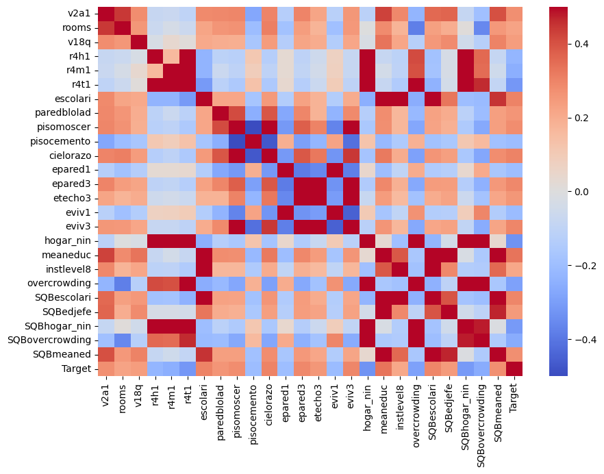

# Poverty Prediction ADS Audit

## Background
A Kaggle competition hosted by the Inter-American Development Bank (IDB) called for an improvement to their income qualification system which they use to allocate financial resources. Social programs often have difficulty ensuring that the right people are given appropriate resources. This is especially challenging in impoverished areas where families lack income and expense records. A popular solution is the Proxy Means Test (PMT), a model that considers a family’s observable household attributes to predict the household’s level of need. However, as population grows and poverty declines the accuracy of this model has deteriorated.

One of the proposed improvements is an automated decision system that employs VotingClassifiers to determine poverty level. We chose this ADS based on its performance in the Kaggle competition and the votes it received from the community. Given the importance and potential impact of the ADS, it is crucial to ensure that the ADS is both accurate and fair.

When evaluating the accuracy and fairness, there are several trade-offs that need to be considered, such as between the false positive rate and true positive rate. While some may argue that it’s preferable to occasionally provide aid to a wealthier household to ensure that no poor households miss out, this approach could be incredibly costly and divert resources from those who need it. On the other hand, if the ADS is too strict in its criteria for poverty, many impoverished families may be overlooked. Therefore, there needs to be an appropriate balance to guarantee that we are effectively and equitably distributing resources to those in need.

## Input and Output
The data was provided directly by the IDB in the form of CSVs. There are 142 columns, with 9,557 rows in the training dataset and 23,856 rows in the validation dataset. Each row represents an individual. Each individual also has a household ID that represents the household they belong to. Other features include house wall material, renting situation, electricity sources, etc. Most of the variables are categorical and are one-hot encoded so they only take values 0 or 1. Therefore, most variables are represented by integers or floats. 

The relationships between the features can be visualized using a heatmap, which shows the magnitude and direction of the relationship between features using a gradient color scale. Because we have 141 features, we created a heatmap of only the most correlated features. In general, we found that features are very weakly correlated with one another. The features that are highly correlated with one another are usually the result of the one-hot encoding. For example, there are four features related to where the household gets its electricity from which are all highly correlated. 

Helper functions from ydata-profiling were used to better understand the relationships between features. We found that certain features had really high correlations, such as v2a1 (monthly rent) and pisoother (material of the floor), and r4h3 (total males) and r4h2 (males ages 12 and under). Some of this information might be redundant, but it could be helpful in gauging the ratio of children to adults in a household, and also give a rough idea of the ages of the individuals of a household. We also found some features that were heavily imbalanced. For instance, v14a (whether the household had a bathroom) was made up of 99% 1s, meaning that almost no households lacked a bathroom. This was also the case with paredfibras (whether the predominant material of walls was natural fibers).

The target class is the poverty level of a household. Specifically, the model outputted a number 1 through 4, with 1 indicating extreme poverty and 4 indicating a non-vulnerable household. Households labeled 1, 2, or 3 suggest that a certain amount of aid is needed while households labeled non-vulnerable households shouldn't receive any aid. Interestingly, our training dataset is extremely imbalanced, with more households labeled 4 than households labeled 1, 2, and 3 combined. 

## Implementation

The first step in the ADS was to clean and preprocess it. This involved converting objects to numeric types. Only a handful of features are represented with objects rather than integers or floats. One example is edjefe/edjefa, which represents the years of education for the male and female heads of the household respectively, which should be represented by a number, but because many people replied “yes” or “no”, this feature is represented by a string. In addition, inconsistencies in the data were attempted to be fixed. For example, separate individuals from the same household would answer differently whether or not the household has a bathroom. These inconsistencies were fixed by making conclusions based on the other features. So if the household does not have running water, it’s safe to assume that they also do not have toilets. Preprocessing the data included the following steps:
- Creating new columns to represent relationships between other columns i.e. 'working_man_fraction" was created by (working males) / (total persons in household). A potential concern with this method is discrimination on sensitive features, namely gender. The dataset lacks data about women in general, so this method groups working women, non-working women, and children all into the same group, while not doing so to men.
- Feature transformation by converting one-hot encoded columns into label encoding. A potential issue with this is the introduction of ordinal relationships between categorical variables. Larger values might weigh more in the model and can therefore add bias.
- In the case of years of education for the male and female heads of household, "yes" was replaced with value 4. This method of imputation discriminates against women who on average had more years of education (8.78 vs. 8.48). Since women have a higher average, replacing missing values with 4 for both groups is unfair for women.

- Missing monthly rent values were replaced with 0. This is extremely problematic because it drastically changes the distribution of monthly rent and makes the heavy assumption that missing rent data means no rent payment. In total, over 4000 samples were affected, and the mean monthly rent went from ₡165,231.61 before imputation to ₡46,628.61. This could possibly have a huge impact on predictions made by the ADS.

- Some columns were aggregated to remove redundancy and create more useful features. For example, the number of rooms per person in the household might be a better indicator of poverty level than looking at the number of rooms and the number of people in the household separately. It’s not clear how the importance of these features was determined since the author says that they were taken from another kernel. 
- The final step was to group the data by household to avoid leakage since individuals that belong to the same household would end up getting the same target label. 
- After the preprocessing, we observed that some variables were correlated with sensitive features. For example, parentesco2 (whether the individual has a spouse) was correlated with gender and estadocivil (marital status) was correlated with age. If we removed sensitive features, the model could still discriminate based on these correlated variables.

VotingClassifier models were used to make predictions on the poverty level. These models work by combining the predictions from multiple individual models to make a prediction. The predictions that received the most “votes” would be used. The models also implement early stopping, a regularization technique to prevent overfitting. The idea behind early stopping is that as the model trains on the dataset, its performance may initially increase before decreasing after a certain point due to the model learning noise in the data. Early stopping stops the training process at that point so that the model has learned the general patterns but not the noise. The performance metric used to determine when to stop training is macro-average F1 score, which is the average F1 score for each of the models.The VotingClassifiers also employ Light Gradient Boosting Machine (LGBM), a tree-based learning algorithm that builds a set of decision trees with each one trying to correct the errors of the previous. The ADS uses two separate VotingClassifiers, one made up of XGBClassifiers and another made up of RandomForests. Final predictions of poverty level are determined by combining the votes of the models.

To validate the predictions made by the ADS, predictions can be made on test data that was previously set aside. This is a technique called cross validation. This solution also received the highest score out of over 600 other entries. Therefore its predictions were the most accurate among the participants in the Kaggle competition, meaning the ADS fulfilled its stated goals of predicting the poverty level of households in Costa Rica. 

## Outcome 
The model performed very well in terms of accuracy metrics. The accuracy metric we looked at was accuracy, which represents the proportion of predictions that the model got right. The model had an accuracy of 0.9258, meaning that around 91% of the poverty level predictions that it made were correct. We also decided to take a look at precision and recall. Precision measures the proportion of correctly predicted positive instances and should be optimized when false positives are costly. In this situation, if the model were to give aid to a household that did not need it, valuable resources would be taken away from those who do. Recall measures the proportion of correctly predicted positive instances out of all actual positive instances and should be optimized when false negatives are costly. In this situation, if the model were to incorrectly classify a poor household as non-vulnerable, then they would be missing out on financial support that they need. Since both of these situations are not ideal, it is important that the model balances precision and recall. The model had a recall score of 0.9861, meaning that it was able to correctly identify around 95% of the households that needed financial support. The model also had a decent precision score of 0.8208, meaning that around 86% of the households that were labeled as needing aid actually needed it. Another metric we looked at was F1 score, which balances precision and recall and it is ideal for imbalanced datasets like ours. The model had an F1 score of 0.9122, which suggests that overall it achieved a good balance between precision and recall with a high overall accuracy.

It also seems like the model is not more or less accurate based on gender, one of the protected features that we are concerned with. If we take a look at the same four accuracy metrics from before (accuracy, precision, recall, and F1 score) and split them based on gender, we see that the model achieves the same score regardless of gender. This is visualized by the bar plots on the right. To further determine if the model is discriminating based on gender, we can take a look at fairness metrics such as false negative rate difference and false positive rate difference. These two metrics measure the difference in error rates between different groups. The model received a value of 0.003 for both metrics, which suggest that its tendency to generate false positives or false negatives is consistent across genders. Therefore, the model does not disproportionately misclassify based on gender. It means that group fairness is satisfied because we have equal outcomes across groups.

The next fairness metric we looked at was demographic parity ratio, which measures the ratio between the selection rates for each gender. The closer the value is to 1, the more equitable the distribution of positive predictions is. The model received a demographic parity ratio of 0.897, which indicates a slight difference in selection rates between the two groups, but it does not necessarily imply a significant bias. We also took a look at equalized odds ratio, which measures how similar the TPR and FPR are across gender groups. Again, a value close to 1 indicates more equitable predictions being made by the model. The model had an equalized odds ratio of 0.974, which suggests a small difference in TPR and FPR rates access groups. This again implies that the model’s performance is consistent with respect to gender. The final fairness metric we looked at was selection rate difference, which measures the disparity in the positive prediction rates between the groups. In this scenario it is looking for the difference between the proportion of men who are classified as needing aid compared to the proportion of women. The model received a difference of 0.046, a small difference, which again suggests that there is only a small variation in the model’s propensity to predict positive outcomes between genders. Based on these fairness metrics, it seems that the ADS does not exhibit discrimination based on gender. The small differences in FNR rates, FPR rates, selection rates, and the demographic parity ratio all point towards relatively equitable treatment of the groups. 

Finally, to better understand the process behind how predictions were made, we used Local Interpretable Model-agnostic Explanations (LIME) to generate explanations for the predictions. This provided for interpretability of the ADS by making the complex models of the black-box machine learning model easier to understand. It also provided insights into how the ADS arrived at a particular prediction and allows us to identify important features in the model. Below are the explanations of predictions that were determined to be indicative of the decision making process:

The LIME explanations reveal possible sources of discrimination based on gender. Many of the features that appear often, such as agg18_escolari_MEAN, agg18_escolari_MAX, and meaneduc, are all related to education. We mentioned previously that females have a slightly higher mean number of years of education than men, and because the ADS’s prediction is affected by years of education, it might inadvertently disadvantage females. However, the bigger problem lies in feature fe_mobile_density, which measures the proportion of females in a household with a mobile phone. Based on the LIME explanation, this feature points the prediction towards the household not receiving aid. Essentially, the model is using the number of females in a household who own a mobile phone to determine whether or not the household is eligible for financial assistance. This is highly problematic, especially because it does not do the same thing for males. 

## Summary

The data included a rich set of information that provided a comprehensive picture of a family's socioeconomic status. The data includes living conditions and family relationships. For the most part, data is well-formed and has enough information to satisfy our goal of determining financial aid distribution. Therefore, data is appropriate for our use case.
Overall, ADS has a high accuracy of 0.92. However, it has significantly lower recall (0.82) and precision (0.82). This means that the model is more likely to be false positives and false negatives, suggesting that model is more likely to give financial aid to people who's not in need. In accuracy metrics across subpopulations, the model maintains the same performance metrics across groups and therefore guarantees group fairness. In fairness metrics, it shows that our model is treating females and male equally. A small selection difference of 0.029 suggests that both male and female have equal chances of being given financial aid. However, the demographic parity ratio of 0.78 and equalized odds ratio of 0.77 are less than ideal; it suggests that one group is less favorable than the other.

We wouldn't recommend deploying this model into production. Even though the ADS has high accuracy metrics across groups and solid fairness metrics, we can't ignore the fact that it uses sensitive features like gender and fraction of females owning mobile phones in households. While ADS may perform well on current validation dataset, we can't guarantee that the model won't discriminate based on sensitive features including gender. When deployed into the real world, there might be model drifts that create significant prediction differences between each subgroup. 
First, we recommend avoiding certain aggregations in pre-processing. In feature extraction steps, we should aggregate new features for both genders, and not just for male. In data imputation, we need to consider potential bias introduced by each imputed value; we should consider options including 0, mean, or median and choose the methods with least bias. Before input to ADS, there're still features that correlate with sensitive columns like gender. We can use a correlation remover to prevent models from using sensitive features. In the prediction model, we should rely on XGBoost's feature importance as the sole indicator. To be able to explain features without knowing specific models and give detailed explanations on a particular instance, we should employ LIME to show a better picture. Therefore, on top of specific model's feature importance, we should add LIME to increase interpretability and accountability of ADS.

